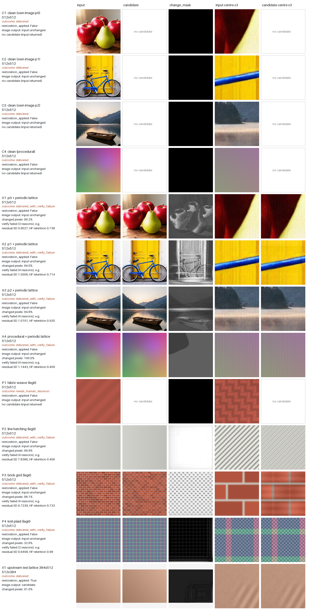

# ComfyUI-MiRipple — Mi-Ripple local diagnosis and repair (unofficial)

[日本語の概要](README.ja.md)

Two ComfyUI nodes that run the **local, deterministic** part of [Mi-Ripple](https://github.com/miyang-ai/Mi-Ripple)
(MIT) on one image: diagnosis of periodic lattice / flat-region granule artifacts, then the official
notch / masked-reduction route with the official verification. CPU only, no model weights, no network.

- **Unofficial.** Not affiliated with, sponsored or endorsed by MIYANG Technology (Shanghai) Co., Ltd. or the
  Mi-Ripple authors. "Mi-Ripple" only names the code this package runs (see [NOTICE](NOTICE)).
- **Local only.** The MIYANG regeneration API is never called: regeneration is disabled in every call, and
  `MIYANG_*` environment variables are ignored. Images never leave the machine.
- **Not a general cleaner.** It handles the two artifact classes Mi-Ripple diagnoses. When the official result
  is not a verified delivery, the node returns **your input unchanged** and says why.

## Nodes

**Mi-Ripple Local Repair** (`image/mi-ripple`)

| input | meaning |
|---|---|
| `image` | one RGB image (batch 1); quantised to 8 bits like the official file input |
| `size_policy` | `512x512 only` (default, the verified scope) refuses other sizes; `any size (unverified)` runs the official code without resizing or cropping |
| `accept_verify_failure` | off (default): a candidate that failed the official verification is not returned as `image` |
| `keep_records` | copy the official records (JSON sidecars, diagnosis / verify boards, XML trace) to `output/mi-ripple/<run id>/` |

| output | meaning |
|---|---|
| `image` | the official final image when `restoration_applied`, otherwise the input tensor unchanged |
| `candidate` | the official final image whenever one was written (also after a failed verification), else the input; for inspection |
| `change_mask` | max over RGB of \|candidate − input\| / 8 levels, clipped to 0..1 |
| `restoration_applied` | true only when `image` is a changed, accepted candidate |
| `outcome` | the official outcome, verbatim |
| `report` | JSON: steps and reasons, verify result, diagnosis summary, face-detection status, versions, upstream commit |

**Mi-Ripple Diagnose** (`image/mi-ripple`) does not change the image. Outputs: `heatmap` (official scale heat map),
`board` (official diagnosis board), `scale_mask` (flagged 128 px scale tiles), `granule_mask` (flat windows flagged
as granular), `lattice_detected`, `report` (including the next action the official rules would take).

### Outcome contract

| official outcome | `image` | `restoration_applied` |
|---|---|---|
| `delivered` with a changed image (verify passed) | candidate | true |
| `delivered`, nothing to repair (`final_is_source_copy`) | input unchanged | false |
| `delivered_with_verify_failure` | input unchanged (candidate only with `accept_verify_failure`) | false (true if accepted) |
| `needs_human_decision`, `failed`, `step_limit` | input unchanged | false |
| `cancelled` (ComfyUI interrupt) | the prompt is interrupted | — |

The reference-only cleaned image of the regeneration route is never produced or returned (that route is not reachable
with regeneration disabled; the node refuses if a regeneration step ever appears).

## What was verified

Machine: one Windows 11 PC, CPU only (no GPU path exists). Reference: the **unmodified** official package at
`865a1481acc22da80427bbebe11f1d7f00dc99be`, installed in its own environment and called through its public API
(`pipeline.run`, `diagnosis.diagnose`). Both sides used numpy 2.5.2, scipy 1.18.1, Pillow 12.3.0,
scikit-image 0.26.0, without OpenCV.

19 inputs:
- 12 main 512×512 cases:
  - C1–C4: clean. Three of my own published images and one procedural image.
  - A1–A4: the same four images plus one fixed periodic lattice (amplitude fixed before the first run).
  - P1–P4: legitimate repeating patterns (fabric weave, hatching, brick grid, knit plaid).
- U1–U4: upstream's own synthetic generators at 512×512.
- E1: 640×480.
- X1–X2: upstream's own 384×512 test images. These are outside the verified size.

| result | cases |
|---|---|
| `delivered`, unchanged (clean) | C1–C4 |
| `delivered_with_verify_failure` → **input returned** | A1–A4, P2–P4, U1, U2, E1 |
| `needs_human_decision` → input returned | P1, U3, U4, X2 |
| `delivered`, changed, verify passed → candidate returned | X1 (384×512, `any size`) |



The figure comes from the real ComfyUI queue (clean install). Every main case is shown, whatever its outcome. The
`image` output equals the input in every row except X1. The Release has the full-resolution PNGs and a
`results.json` with checksums.

**All 19 cases match the official run exactly.** The layers compared were:
- decoded input pixels;
- outcome and step list;
- diagnosis JSON and verify JSON (timestamps and paths excluded);
- every image the official code writes (decoded pixels);
- the diagnosis board;
- every node output, recomputed from the official files by the contract above.

This held in all of these settings:
- the node runtime, called directly;
- a real ComfyUI v0.38.0 HTTP queue (`--cpu --cache-none`);
- a clean install from `git archive` into a differently named folder of a fresh ComfyUI + venv.

The official runs were deterministic across repeats.

Honest reading of these results:
- None of the 512×512 lattice cases passed the official verification (structure residual / high-frequency retention
  limits), so the node returned the input. The only verified delivery observed was upstream's own 384×512 test image.
- On legitimate patterns the official notch candidate can visibly damage the pattern (P3 brick mortar); the official
  verification rejected it and the node returned the input. With `accept_verify_failure` you get that candidate.
- Other images, sizes, library versions and OpenCV-enabled environments were not compared.

Also tested:
- Real ComfyUI queue:
  - the same prompt executed twice;
  - A→B→A gave the same results;
  - off-size input and batch 2 were refused with a clear message, and the next prompt ran normally.
- Interrupt, which is step-granular, not instant. Upstream checks for cancel between its steps.
  Measured over the development and clean installs:
  - 512×512: stopped 90–737 ms after `/interrupt` (10 trials; a full run took 1.5–1.7 s).
  - 1536×1536: stopped 0.3–6.7 s after `/interrupt` (8 trials; a full run took 13–14 s).
  - Interrupted prompts produce no outputs.
- No network: with `MIYANG_API_KEY` set and sockets blocked, Repair and Diagnose make no connection attempt and never
  create a regeneration client (unit test).
- CI (GitHub Actions, Ubuntu + Windows, CPU):
  - official package vs node runtime on the six upstream synthetic cases, all layers;
  - vendored files vs upstream;
  - unit and node tests, including broken-OpenCV fakes and the no-network test.

Speed on the test machine (CPU), 512×512: Local Repair 0.7–1.7 s, Diagnose 0.6–0.9 s.

## Optional OpenCV and the one local patch

Upstream uses OpenCV Haar cascades, when installed, to protect faces during verification. An OpenCV that imports but
cannot be used makes the upstream run end `failed` ([Mi-Ripple#1](https://github.com/miyang-ai/Mi-Ripple/issues/1)).
This package carries **one patch** to the vendored `reference.py`:
[`patches/0001-detect-faces-best-effort.patch`](patches/0001-detect-faces-best-effort.patch). The same change is
proposed upstream as [Mi-Ripple#2](https://github.com/miyang-ai/Mi-Ripple/pull/2).

With the patch, face detection is best-effort:
- OpenCV not installed: `cv2_unavailable`.
- OpenCV present but unusable: `cv2_error:<type>`, and the run continues without face boxes.
- A working OpenCV is unchanged.

The report shows this status.

Without OpenCV, the patched and unmodified code behave identically, which is the official comparison above. With
three broken-OpenCV fakes:
- the node matched the *patched* reference on all 19 cases;
- the unmodified official code ended `failed` on the 11 cases that reach verification.

If a working OpenCV is installed in your ComfyUI environment, face boxes take part in verification exactly as
upstream; that configuration was not compared with the official code.

## Install

From the ComfyUI Manager / Registry (`mi-ripple`), once listed, or:

```
cd ComfyUI/custom_nodes
git clone https://github.com/hiroki-abe-58/ComfyUI-MiRipple
pip install -r ComfyUI-MiRipple/requirements.txt   # scikit-image, httpx (httpx is only imported by upstream)
```

No models or downloads are needed. Example (API format): [`workflows/api/miripple_repair_and_diagnose.json`](workflows/api/miripple_repair_and_diagnose.json).
It scales ComfyUI's bundled `example.png` to 512×512 with the core ImageScale node, because the default policy accepts
512×512 only.

## Limits

- Verified scope: 512×512 RGB, batch 1. Other sizes run only with `any size (unverified)`. Batches and non-RGB
  inputs are refused; nothing is resized, cropped or dropped silently.
- Input is quantised to 8 bits (round to nearest), as with the official PNG input.
- Results can depend on numpy / scipy / scikit-image / Pillow versions; the versions are in every report.
- Not a denoiser, upscaler or general artifact remover; outcomes and thresholds are upstream's.

## Reproduce

`scripts/` contains the runners used above:
- `run_official.py` runs the official package in its own environment;
- `run_node_runtime.py` runs the node runtime;
- `compare_runs.py` does the layer-by-layer comparison;
- `queue_tests.py` runs the real ComfyUI queue tests;
- `make_ci_cases.py` writes the upstream synthetic cases;
- `make_demo.py` makes the demo figure.

The CI workflow shows the exact steps.

## License

MIT ([LICENSE](LICENSE)). Vendored Mi-Ripple code: MIT, Copyright (c) 2026 MIYANG Technology (Shanghai) Co., Ltd.
([NOTICE](NOTICE), [`miripple_comfy/vendor/LICENSE.mi-ripple`](miripple_comfy/vendor/LICENSE.mi-ripple)).
MIYANG names and logos are trademarks of their owner; no logo or upstream image is included.
